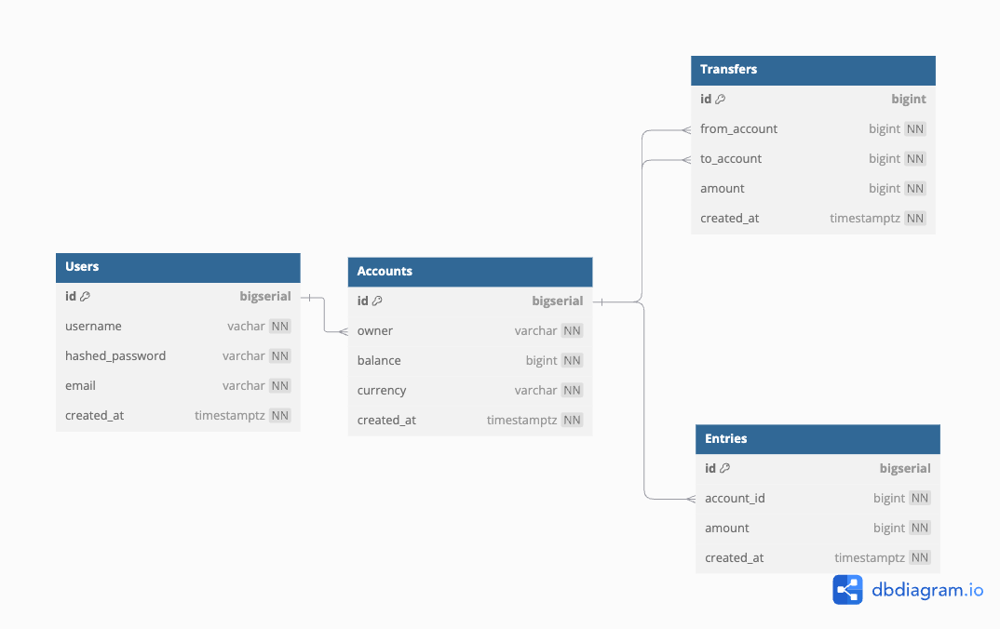

# Bank Application using golang

## Database architecture




## Install packages required for the development

- Database Migration
  
```bash
brew install golang-migrate
brew install sqlc
migrate create --ext sql -dir db/migration -seq init_schema
go install github.com/golang/mock/mockgen@v1.6.0
export PATH=$PATH:$(go env GOPATH)/bin
```

## Database setup

- setup Database
  
```bash
make postgres-setup
make postgres-start
make createdb
```

- Destroying database

```bash
make postgres-destroy
```

## Starting the service

```bash
make start-server
```


```bash
user@C2-DH2-R22-CO-S239:~$ ab -n 100000 -c 10 http://154.210.130.72/
This is ApacheBench, Version 2.3 <$Revision: 1879490 $>
Copyright 1996 Adam Twiss, Zeus Technology Ltd, http://www.zeustech.net/
Licensed to The Apache Software Foundation, http://www.apache.org/

Benchmarking 154.210.130.72 (be patient)

Completed 10000 requests

Completed 20000 requests
Completed 30000 requests
Completed 40000 requests
Completed 50000 requests
Completed 60000 requests
Completed 70000 requests
Completed 80000 requests
Completed 90000 requests
Completed 100000 requests
Finished 100000 requests


Server Software:        
Server Hostname:        154.210.130.72
Server Port:            80

Document Path:          /
Document Length:        0 bytes

Concurrency Level:      10
Time taken for tests:   353.866 seconds
Complete requests:      100000
Failed requests:        0
Total transferred:      0 bytes
HTML transferred:       0 bytes
Requests per second:    282.59 [#/sec] (mean)
Time per request:       35.387 [ms] (mean)
Time per request:       3.539 [ms] (mean, across all concurrent requests)
Transfer rate:          0.00 [Kbytes/sec] received

Connection Times (ms)
              min  mean[+/-sd] median   max
Connect:        0    0   0.1      0       2
Processing:     1    3  10.9      2     331
Waiting:        0    0   0.0      0       0
Total:          1    4  10.9      2     331

Percentage of the requests served within a certain time (ms)
  50%      2
  66%      2
  75%      2
  80%      2
  90%      3
  95%      4
  98%     16
  99%     51
 100%    331 (longest request)
```

```bash

```